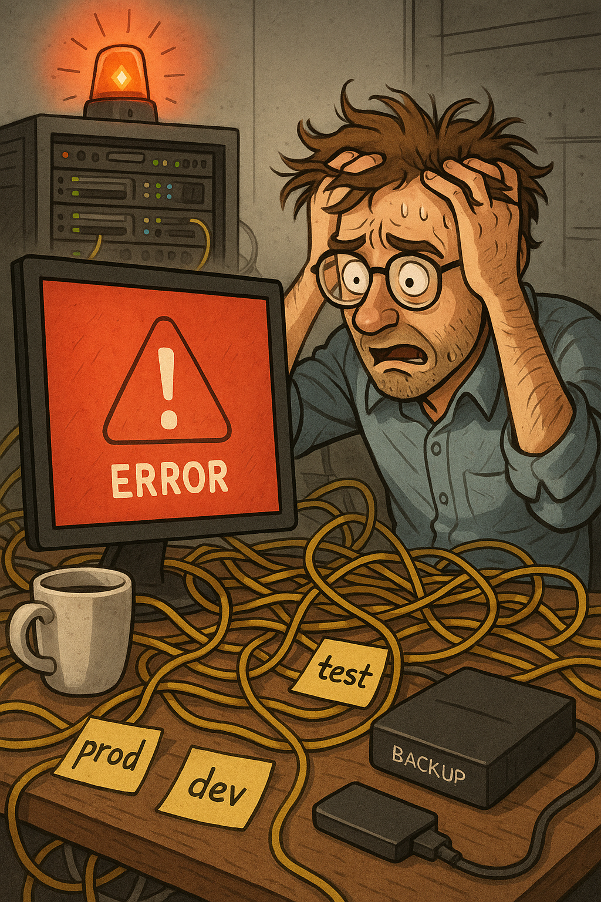

# I Lost My Automation Server: A Real-World Incident Response Lesson

<figure><figcaption></figcaption></figure>

#### TL;DR

On **2025-07-13**, I accidentally nuked my production automation server while working on a new n8n workflow involving human-in-the-loop approvals. The root cause: a mix of outdated scripts, Docker volume deletion, and blind copy-pasting without verifying. Recovery took 1 hour and 40 minutes. This post is a breakdown of what happened, what I learned, and how you can avoid the same mistakes.

***

### 🗕️ The Timeline

* **2025-07-13 15:22:16**: Incident begins. Automation server (n8n) goes down.
* **2025-07-13 17:02:18**: Server restored.

Thanks to **Uptime Kuma**, I had exact timestamps.

<figure><figcaption></figcaption></figure>

***

### 🔍 Background: What I Was Trying To Do

I was working on a workflow in **n8n** that involved a human (me) approving an automation before it fired off. Since this workflow involves using **expensive API tokens**, I wanted to add an approval checkpoint.

The approval link was going to `localhost` (since n8n runs in Docker), so I had to change the **environment variables** to set the proper webhook URL.

While doing this, I noticed n8n had an update. So I figured:

> "Let me pull the new image and spin it back up."

**Spoiler:** Bad idea. Real bad.

***

### 💥 The Mistake

I had two setup scripts:

* One using **Docker Compose** (the good one)
* One **not using Docker Compose**, used during earlier testing

I accidentally used the **older script**, which had this evil line:

```
docker volume rm n8n_data
```

This script was something I had written months ago while testing. I hadn’t documented it properly, and in classic homelab fashion, I just copy-pasted it without a second thought.

#### Mistake #1:

Using outdated scripts without checking contents.

#### Mistake #2:

No clear **documentation** or **naming conventions** for safe vs. dangerous scripts.

***

### 🧯 The Backup Fiasco

I _did_ have a backup automation in place. Built it during a commute to work one day. It wrote a backed workflows.

But:

* I had **never tested** restoring from it.
* It **didn't back up credentials**. So even though the workflows were restored, they couldn’t function.
  * Lost SSH credentials
  * Gemini and Grok API keys
  * Database access creds
  * AWS keys

Restoration was manual. And painful.

***

### 😩 It Was a Sunday...

I had plans to do two HTB boxes. Managed just one thanks to the chaos.

But I’m glad it happened.

Because this:

* Showed me the **importance of disaster recovery testing**
* Proved how quickly small issues can scale into major outages (still in a homelab)
* Made me rethink how I handle production vs. test environments even in a homelab

***

### 🧐 Key Takeaways

#### For Beginners:

This is what a **real-world incident** looks like. It's not always some elite hacker in a hoodie. Sometimes, it's just you... tired... copy-pasting from an old script.

#### For Cybersecurity Pros:

This ties directly into **ISO 27001**, **SOC 2**, and other compliance frameworks:

* **Change Management**: There was none.
* **Backup & Recovery**: Untested, incomplete.
* **Environment Separation**: Blurred lines between prod and test.

I’ve often rolled my eyes at checkbox-based security, but this incident reminded me:

> If you understand the _principles_ behind the checkboxes, they’re actually useful.

***

### 🌐 The Bigger Picture

This server started as a small one-box deployment. But over the last six months, my homelab has grown massively:

* Servers across four physical locations
* Connected to **3 VPCs in AWS** (across 2 regions), **Oracle**, **GCP (Firebase etc)**, and **Vultr**

All interconnected. And all dependent on this automation hub.

You never realise the **value of a proper backup**... until you lose something.

***

### ✅ Action Items Moving Forward (With Homelab in Mind)

1. **Clarify Environments Without Overengineering**\
   Clearly label scripts, directories, and containers as `dev`, `test`, or `prod`. You don’t need enterprise-level separation—just enough to avoid confusion.
2. **Credential Backup Strategy (Minimal and Secure)**\
   Use lightweight secret storage (like encrypted `.env` backups or Infisical) to at least mirror n8n credentials periodically. It doesn’t have to be fancy—just functional and secure.
3. **Test Restore Once a Month (Even If It's Partial)**\
   Simulate restoring part of your workflow or even one key container. The goal isn’t perfection, just confidence that the process works when needed.
4. **Comment Scripts With Warnings**\
   Add `# DANGER ZONE` comments around destructive commands. Color-code them in your terminal or add safety prompts before volume wipes.
5. **Lightweight Version Control**\
   Even if you’re not using GitHub for every container, at least drop versions of critical scripts in a private repo or synced folder.
6. **Offline "What to Do When It Breaks" Doc**\
   A plain text or Markdown file with simple recovery steps: what to pull, where to mount, which container does what. Print it, or store it somewhere your future, sleep-deprived self can find.
7. **Stop Blind Copy-Pasting (Especially Late at Night)**\
   Use aliases, cheat sheets, or pre-tested templates for common rebuild tasks. Make it harder to screw up muscle memory with irreversible commands.
8. **Alert on Downtime Using Tools You Actually Check**\
   Uptime Kuma is great—just make sure it’s pinging you somewhere you’ll notice (Telegram, Discord, email, etc.).

***

### 🧹 Final Words

Incidents aren’t always glorious breaches or zero-days. Sometimes they’re caused by the engineer who wrote the system... and got too comfortable with it.

This post is both a confession and a guide. Learn from my mistakes, and make sure your future self won’t hate your present self.
