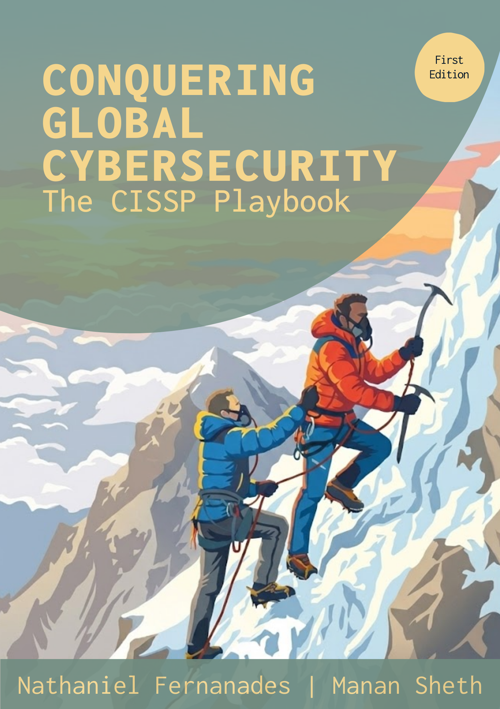

# Conquering global Cybersecurity | 8 February 2026

Hey!\
We wanted to personally invite you to our book launch. This book means a lot to us - it represents hard work, growth, and a goal we have been building towards for a long time.

We are celebrating this day with our friends and family, and we would genuinely love for you to be part of it. Your presence will make the moment even more special for us.\
All the event details and the venue location are shared on this page. Hope to see you there!

<figure><figcaption></figcaption></figure>

## Event Details

Join us on the 8 of February at 5:00 PM IST

### Location&#x20;

Juhu Rooftop, 14, Cross Road No. 10, Gulmohar Road, Juhu, Mumbai, Maharashtra 400049



## FAQs

How long will the event be?

Around 1.5 hours

Will the book be available at the venue?

The Kindle launch is on 8 February.

Closest public transport options

you can get down form andheri station and take a rickshaw (5 min from the station). You can also get down at DN Nagar metro station and take a rickshaw (8 min from the metro station)

Is this event invite-only or open to all?

It's open to all

