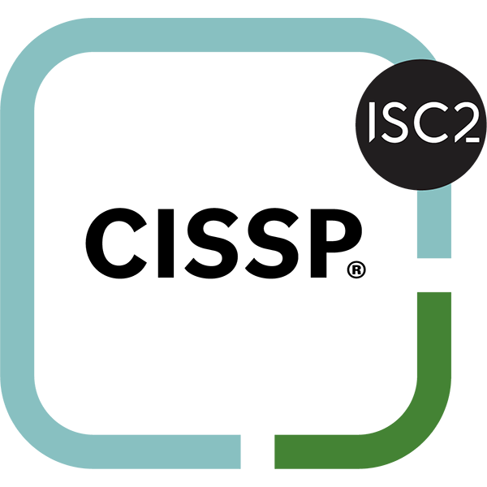

# auditd

## Introduction

* a system service that provides auditing capabilities for Linux
* responsible for writing audit records to the disk
* At startup
  * the rules in /etc/audit/audit.rules are read by auditctl and loaded into the kernel
* some key things you can do with auditd:
  * System Call Monitoring:
    * Track specific system calls made by processes.
    * Useful for detecting unauthorized access attempts or unusual behavior.
  * File and Directory Watching:
    * Monitor changes to critical files and directories.
    * Detect unauthorized modifications to system files.
  * User Activity Tracking:
    * Log user logins, logouts, and actions performed.
    * Monitor sudo usage and command execution.
  * Network Connection Logging:
    * Record incoming and outgoing network connections.
    * Useful for detecting unusual network activity.
  * Security Policy Enforcement:
    * Implement and monitor compliance with security policies.
    * Set up alerts for policy violations.
  * Process Tracking:
    * Monitor process creation and termination.
    * Track process ancestry (parent-child relationships).
  * Command Execution Logging:
    * Record specific commands executed by users.
    * Useful for forensic analysis and compliance.
  * Permissions and Ownership Changes:
    * Monitor changes to file permissions and ownership.
    * Detect potential privilege escalation attempts.
  * Account Management:
    * Log account creation, deletion, and modification events.
    * Monitor changes to group memberships.
  * Custom Rules and Triggers:
    * Create custom audit rules for specific security requirements.
    * Set up triggers for real-time alerts on critical events.
  * Performance Monitoring:
    * Track system resource usage by processes.
    * Monitor for potential resource abuse or DoS attempts.
  * Compliance Reporting:
    * Generate reports for compliance with standards like PCI-DSS, HIPAA, etc.
    * Provide evidence for security audits.
  * Integration with SIEM:
    * Forward audit logs to Security Information and Event Management systems.
    * Enable centralized analysis and correlation of security events.
  * Executable Integrity Checking:
    * Monitor changes to executable files.
    * Detect potential malware installations or unauthorized modifications.
  * Kernel Module Monitoring:
    * Track loading and unloading of kernel modules.
    * Useful for detecting rootkits or unauthorized kernel modifications

## Install

```
sudo apt-get install auditd audispd-plugins
```

```
sudo systemctl enable auditd
```

## Config

* `/etc/audit/auditd.conf` - configuration file for audit daemon
* `/etc/audit/audit.rules` - audit rules to be loaded at startup
* `/etc/audit/rules.d/` - directory holding individual sets of rules to be compiled into one file by augenrules.

## Logs

```
cat /var/log/audit/audit.log
```

## Setup

* setup auditctl to look into the file
  * secret.data
  * this is non persistant
  * wont servivie a reboot

```bash
auditctl -w /home/groot/secret.data -p rwxa
```

\


<figure><figcaption></figcaption></figure>

* \
  r=read
* w=write
* x=execute
* a=attribute change
* meaning of attribute change
  * **File Permissions:** Changing the read, write, or execute permissions of a file or directory (e.g., using `chmod`).
  * **Ownership:** Modifying the ownership of a file or directory (e.g., using `chown`).
  * **Timestamps:** Altering the access or modification timestamps of a file or directory.
  * **Extended Attributes:** Modifying or deleting extended attributes associated with a file, which may include additional metadata.
  * **Linking/Unlinking:** Creating or removing hard or symbolic links to files.

#### Log all activity in dev/shm folder

```
sudo auditctl -w /dev/shm -p rwxa -k dev_shm_monitor
```

### For Persistence

```
sudo nano /etc/audit/audit.rules
```

```
-w /home/groot/secret.data -p rwxa
```

```
sudo systemctl restart auditd.service
```

## Action

* [auditd](app://obsidian.md/auditd) can be used to trigger a task when a log is triggered
  * audispd can be used to perform attentional action post event log
    * `audisp-remote`: Sends events to a remote system.
    * `audisp-syslog`: Forwards audit logs to the system's syslog for further processing.
    * `af_unix` : can be used for inter process communication
    * `audispd-zos-remote` : used to interact with IBM z/OS mainframes
    * `au-prelude` : the Forware logs to Prelude SIEM

## References

* [https://sematext.com/glossary/auditd/](https://sematext.com/glossary/auditd/)
* [https://slack.engineering/syscall-auditing-at-scale/](https://slack.engineering/syscall-auditing-at-scale/)
* go through
  * [https://www.youtube.com/watch?v=lc1i9h1GyMA\&ab\_channel=IppSec](https://www.youtube.com/watch?v=lc1i9h1GyMA\&ab\_channel=IppSec)

### Question

#### What is the difference between Audispd and Auditd?

* **The auditd daemon collects events from the kernel component and writes them to a log file**.&#x20;
* **The audisp dispatcher daemon relays events to other applications for additional processing**
