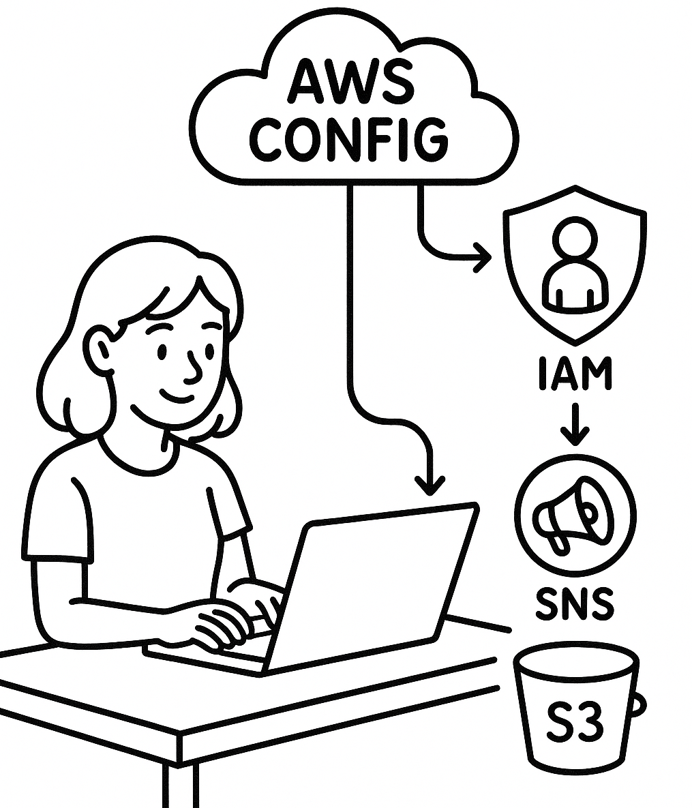

# Building a Comprehensive AWS Config Lab: Tracking IAM Configuration Changes with SNS and S3

<figure><figcaption></figcaption></figure>

### Introduction

Identity and Access Management (IAM) sits at the heart of AWS security. A single unnoticed change to a role, policy, or user could open the door to privilege escalation or unauthorised access.

This lab demonstrates a **Proof-of-Concept (POC)** setup using **AWS Config** to **track IAM configuration changes** in real-time, send **notifications via SNS**, and store **detailed history in S3** for long-term analysis.

This implementation is simple enough for a lab environment yet practical enough to adapt directly to production.

### Why This Lab Matters

AWS Config is a **configuration change tracking** service that can record the history of your AWS resources. By targeting IAM resources specifically, this setup focuses on **high-impact security changes** such as:

* Creation or deletion of IAM users
* Policy attachments or removals
* Trust policy modifications
* Privilege escalations

With **SNS for real-time alerts** and **S3 for historical storage**, you get both immediate visibility and an audit-ready trail of every change.

### Lab Architecture

**Flow Overview:**

1. **AWS Config** records IAM resource changes.
2. **SNS Topic** receives change notifications.
3. **S3 Bucket** stores configuration history and snapshots.

### Prerequisites

Before you start, make sure you have:

* An AWS account with permissions to:
  * Create and configure AWS Config
  * Create IAM roles, SNS topics, and S3 buckets
* Basic understanding of IAM roles and policies

**Extra Considerations:**

* **Regional Awareness:** IAM is global service, enable AWS Config’s _global resource recording_ in only one region to avoid duplicate charges.
* **Cost Management:** AWS Config charges per configuration item. Record selectively.
* **Permissions:** AWS Config’s service role must have permissions for S3 and SNS

### AWS Config Setup

### Let AWS Config Create Storage and Notifications

For this lab, instead of manually creating the S3 bucket and SNS topic, we used AWS Config’s built-in option to **automatically provision** them during initial setup.

<figure><figcaption></figcaption></figure>

When you choose this option:

* AWS Config creates an S3 bucket with a unique name (e.g., `awsconfig-bucket-1234567890-region`).
  *

      <figure><figcaption></figcaption></figure>
* An SNS topic is created and automatically linked to AWS Config.
  *

      <figure><figcaption></figcaption></figure>
* All necessary permissions are applied by default.

**Why this is useful for a POC:**

* Zero additional setup - you can go from nothing to a working lab in minutes.
* AWS handles IAM policies for these resources automatically.
* Great for testing AWS Config capabilities without worrying about infrastructure.

**Things to note for production:**

* Auto-created buckets have generic names and no lifecycle policies by default - storage can grow quickly.
* SNS topics will need explicit subscription management to send notifications where you need them.
* You might want to enable S3 versioning and custom bucket policies for compliance.

<figure><figcaption></figcaption></figure>

